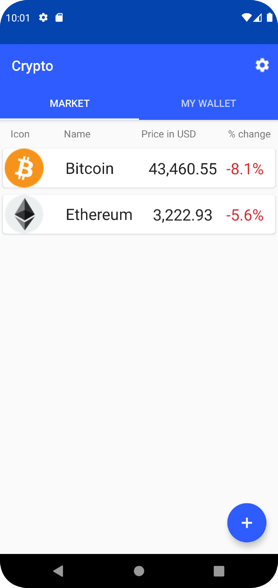
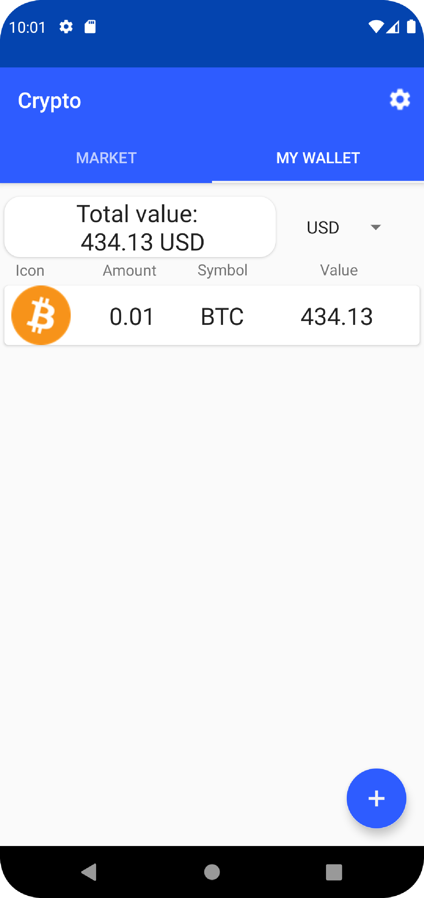
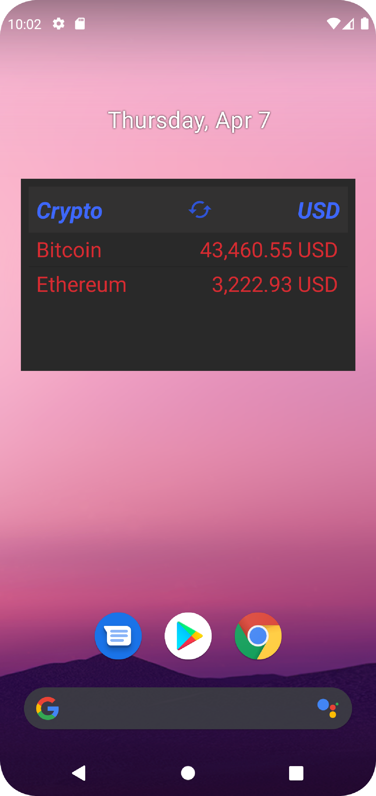
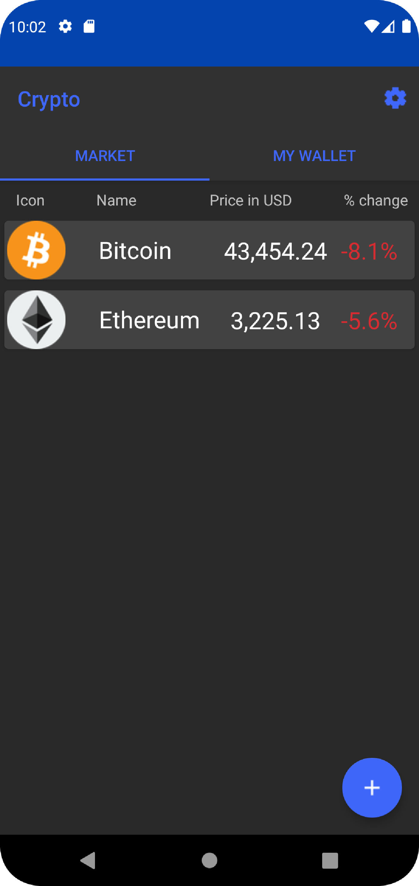

# Crypto_Android
Android app for cryptocurrencies enthusiasts

---

## Tech used
### Java
### RxJava, Room database
### External API (more details below)

---

## API used 
[Coinmarketcap API](https://coinmarketcap.com/api/) - due to limitations this API offers in it's free version user may experience bugs when refreshing data too quickly

---

## Features

### Check price of your favourite currencies

### Keep track of your portfolio

### Stay updated using widget

### Switch between light and dark mode for your comfort

